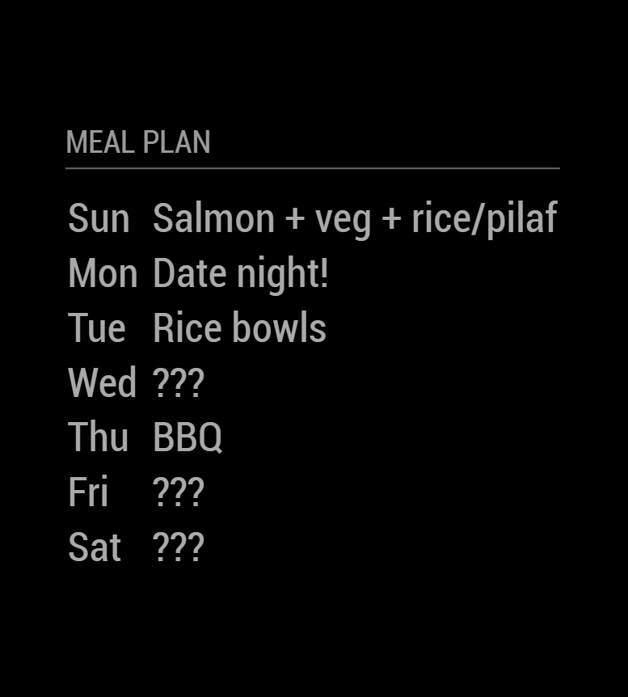
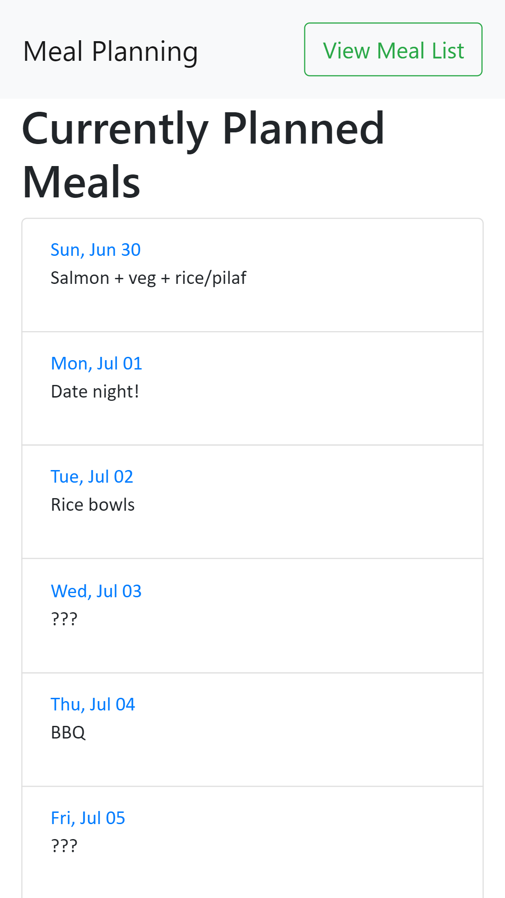

# Meal Plan - [Magic Mirror Module](https://github.com/MichMich/MagicMirror)
Provides a simple, rolling,  week long list for meal planning. Meal names and scheudle is created via web interface hosted as part of the Magic mirror. An unplanned day can be configured to remain unplanned ("???") or randomly selected from existing meal names.

## Feature Plans
- [ ] Track last used date/meal frequency
- [ ] Add Ingredients List
- [ ] Add Sidedish selections
- [ ] Link web interface with MagicMirror calendar items (Holidays, and events, etc.)
- [ ] Pull Meals/Recipes from existing APIs (?)
